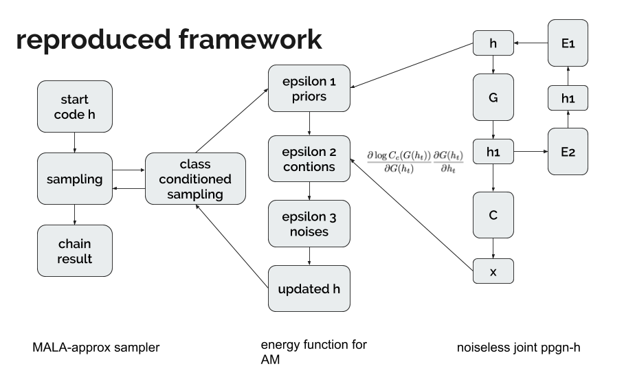

# ppgn-pytorch

Reproduction of noiseless joint PPGN-h model from Plug&Play network in PyTorch.
Sampler methods include class-conditioned sampler and class-conditional sampler from real image.

There are 5 models in the original PPGN. This repo reproduced the best noiseless joint PPGN-h model. See implemented framework here:

Original implementation in caffe: https://github.com/Evolving-AI-Lab/ppgn

The caffe implementation does not support multi-gpu training ("Note that it takes ~12 days to fully train this net on ImageNet on a single TitanX using Caffe.", by PPGN paper author), which is one of the motivations for this reproduction in pytorch.
